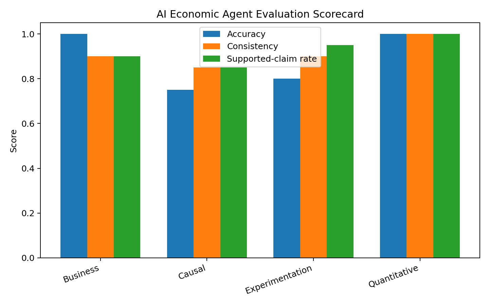

# AI Economic Agent Evaluation

A reproducible evaluation framework for measuring the accuracy, consistency, and reliability of AI agents on economic and business reasoning tasks.

## Why This Project?

Large language models can produce highly fluent economic analysis while still making subtle but consequential errors.

An AI agent may calculate a metric correctly but draw the wrong causal conclusion, recommend an economically inconsistent action, or introduce unsupported claims with high confidence.

For economic and business applications, therefore, evaluating an AI system requires more than measuring simple answer accuracy.

This project develops a structured benchmark for evaluating AI agents across multiple dimensions of economic reasoning and decision quality.

---

## Evaluation Questions

The framework asks:

- Does the agent reach the correct economic conclusion?
- Can it perform quantitative business calculations accurately?
- Does it distinguish correlation from causation?
- Does it reason correctly about experiments and treatment effects?
- Does it provide consistent answers across related tasks?
- Does it introduce unsupported claims or assumptions?

---

## Benchmark Design

The synthetic benchmark contains **60 economic and business reasoning tasks** across four categories:

- Quantitative reasoning
- Experimentation
- Causal reasoning
- Business decision-making

Each response is evaluated across several dimensions rather than using a single aggregate accuracy measure.

### Core Evaluation Metrics

**Accuracy**  
Whether the agent reaches the correct answer or conclusion.

**Consistency**  
Whether reasoning remains internally consistent across benchmark tasks.

**Unsupported-Claim Rate**  
Whether the response introduces claims that are not supported by the information provided.

---

## Overall Results

Across 60 benchmark tasks:

| Metric | Result |
|---|---:|
| Overall Accuracy | 85% |
| Consistency | 90% |
| Unsupported-Claim Rate | 8.3% |

The results show that strong overall performance can conceal meaningful differences across reasoning domains.

---

## Performance by Task Category

| Category | Tasks | Accuracy | Consistency | Unsupported-Claim Rate |
|---|---:|---:|---:|---:|
| Quantitative | 10 | 100% | 100% | 0% |
| Business | 10 | 100% | 90% | 10% |
| Experimentation | 20 | 80% | 90% | 5% |
| Causal Reasoning | 20 | 75% | 85% | 15% |

The largest weakness appears in **causal reasoning**.

Although the agent performs strongly on direct quantitative and business calculations, performance deteriorates when tasks require distinguishing association from causation or reasoning about identification.

---

## Key Finding: Causal Reasoning Is the Main Failure Mode

Causal reasoning produced:

**75% accuracy**

compared with 100% accuracy on direct quantitative tasks.

It also generated the highest unsupported-claim rate:

**15%**

This distinction matters in real-world AI deployment.

An AI system can perform arithmetic correctly while still giving a decision-maker an incorrect explanation of **why** an outcome occurred.

For applications involving experimentation, pricing, policy, marketplaces, or strategic decision-making, these errors may be considerably more consequential than simple calculation mistakes.

---

## Evaluation Scorecard



The scorecard compares accuracy, consistency, and supported-claim performance across benchmark categories.

---

## Failure-Mode Analysis

The benchmark highlights several classes of potential AI failure:

### 1. Correlation vs. Causation

The agent may correctly identify an observed relationship while incorrectly interpreting that relationship as causal.

### 2. Experimental Reasoning

Performance can deteriorate when questions require reasoning about treatment effects, randomization, or experiment validity rather than simple metric calculation.

### 3. Unsupported Economic Claims

Some responses introduce assumptions or explanations that are not justified by the information provided.

### 4. Inconsistent Decision Logic

An agent may apply different economic reasoning to conceptually similar problems.

These failure modes motivate evaluation systems that examine reasoning quality rather than relying exclusively on aggregate accuracy.

---

## Why Aggregate Accuracy Is Not Enough

An overall accuracy score of **85%** might initially appear strong.

But aggregate performance hides an important pattern:

> The agent performs substantially better on direct quantitative tasks than on causal reasoning.

For high-stakes economic applications, the distribution of errors can matter more than average accuracy.

A system that makes occasional arithmetic mistakes may be easier to detect and correct than a system that confidently provides incorrect causal explanations.

---

## Practical AI Evaluation Framework

A production evaluation system could extend this framework using:

- Larger benchmark libraries
- Multiple AI models
- Repeated prompt perturbations
- Human economist grading
- LLM-as-judge comparisons
- Calibration and confidence scoring
- Inter-rater reliability
- Adversarial economic scenarios
- Automated regression testing after model updates

This would allow teams to evaluate not only whether a new model is "better," but **where it improves, where it regresses, and which errors create the greatest business risk.**

---

## Methods Demonstrated

This project demonstrates:

- AI/LLM evaluation design
- Benchmark construction
- Economic reasoning evaluation
- Causal reasoning assessment
- Failure-mode analysis
- Reliability measurement
- Model scorecard development
- Python-based evaluation pipelines
- Reproducible testing
- Business interpretation of AI performance

---

## Tech Stack

**Python**

- pandas
- NumPy
- matplotlib
- pytest

The project separates benchmark construction, evaluation logic, testing, and reporting to support reproducible model evaluation.

---

## Repository Structure

```text
ai-economic-agent-evaluation/
│
├── notebooks/
│   └── economic_agent_evaluation.ipynb
│
├── results/
│   ├── benchmark_results.csv
│   ├── category_scorecard.csv
│   ├── overall_scorecard.csv
│   └── evaluation_scorecard.png
│
├── src/
│   ├── __init__.py
│   ├── benchmark.py
│   └── evaluator.py
│
├── tests/
│   └── test_evaluator.py
│
├── .gitignore
├── README.md
├── RESUME_BULLET.txt
└── requirements.txt
```

---

## Business Implication

The central lesson from this evaluation is that **AI reliability is multidimensional**.

A model that performs well on calculations is not necessarily reliable for causal or strategic reasoning.

For organizations deploying AI agents in economic analysis, experimentation, pricing, forecasting, or business decision-making, evaluation frameworks should therefore explicitly test the reasoning capabilities that matter for the decisions the system will influence.

---

## Data and Evaluation Disclaimer

All benchmark tasks, responses, and evaluation results in this repository are **synthetic and generated specifically for this portfolio demonstration**.

The reported results are not evaluations of any named commercial or open-source AI model and should not be interpreted as claims about the performance of a specific deployed system.
